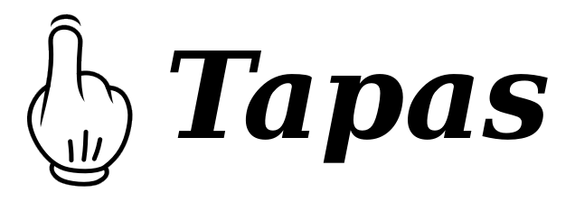

## Overview

Tapas is a programming language designed to be embedded in C++. 


## Features

- Header-Only
- Light
- Fast Speed


## Documents

[1. Syntax](./docs/1_Syntax.md) 

[2. Developers Documentation](./docs/2_Developers.md) 

[3. Examples](./docs/3_Examples.md) 

[4. To Do List](./docs/4_ToDoList.md) 


## Usage

Suppose we want to call the Tapas script in C++, then we can do it the following way: 

```c++
// file `test.cpp`
#include "Tapas/tapas.h"

int main(int argc, char ** args)
{
	tapas::tsession sess;  // create a Tapas session
	sess.compile_file("example.tap");  // compile Tapas scripy file
	sess.eval_bycodes("example.tap");  // evaluate Tapas source codes
	return 0;
}
```

where the Tapas script file `example.tap` looks like

```
// file `example.tap`
let abs = (x) {
	if (x >= 0) {
		return x
	}
	else {
		return -x
	}
}
abs(-2).std::print()
```

Then, we just compile the C++ code by 

```sh
g++ test.cpp -std=c++11 -I[path to the "include" folder] -o test
./test
```

and the Tapas script is executed. 


